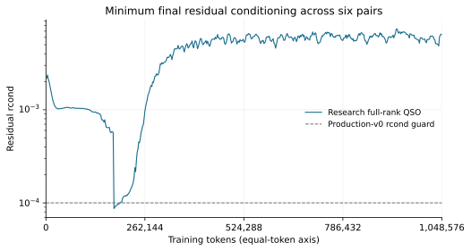
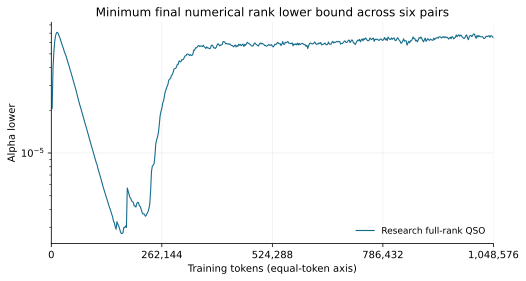
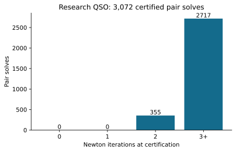
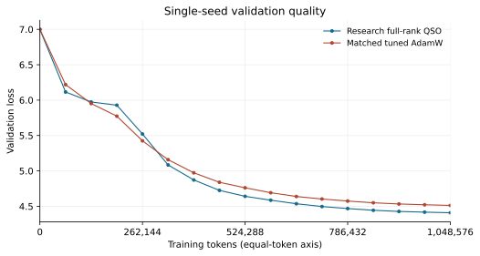
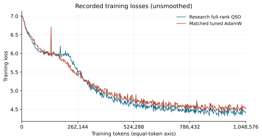
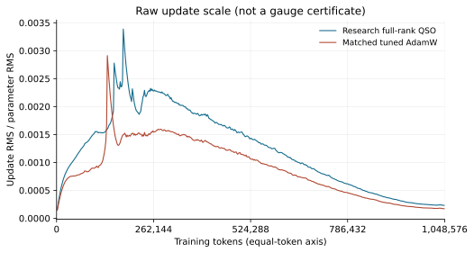

# Controlled 512-step full-rank epsilon-LMO research trajectory

Result: **A — CONTROLLED 512-STEP TRAJECTORY PASSES; QUALITY PROMISING**.

The explicitly isolated research admission policy completed 512 updates and
1,048,576 nonrepeated training input tokens. All **3,072/3,072** paired solves
returned conservative primary certificates. There were no rank-ambiguity
events, invalid numerical actions, solver failures, or CPU reference calls.
The historical step-87 blocker was reproduced exactly at the saved pair inputs
and crossed using the research certificate. Checkpoint continuation was exact.

At equal tokens, final validation loss was **4.408996** for research QSO versus
**4.512301** for the matched tuned AdamW reference. The final-three-checkpoint
means were **4.417955** versus **4.522282**. This passes the predeclared gate for
recommending a **separate** multi-seed research study. It does not establish
statistical significance or general optimizer superiority.

Production-v0 is unchanged. This is **QSO full-rank epsilon-LMO research
admission**, not a successful unchanged production-v0 confirmation. Its
below-old-guard output contract is different. No additional seed, sweep,
production integration, or deficient-face heuristic was run.

## 1. Frozen experiment and provenance

The source of the configuration, initialization, data order, and reference is
the original Stage-D manifest at
`/home/prignano/qnormuon-runs/lr-stage-d/study-29024/manifest.json`.
The historical QSO run is
`confirmation-qso-a0.0003-q0.00122474487139`; the reused AdamW reference is
`confirmation-adamw-a0.0002-q0.001`. See [Stage D](QSO_LR_SWEEP.md),
[failure forensics](STAGE_D_QSO_FAILURE_FORENSICS.md), and the
[fixed-fixture admission experiment](FULL_RANK_EPSILON_LMO_ADMISSION_EXPERIMENT.md).

| Setting | Value |
|---|---|
| Seed | 2026, one seed only |
| Model | 11,457,408 parameters; vocabulary 1024, width 384, six blocks, six attention heads, SwiGLU hidden width 1024 |
| Supported pairs | Six explicitly registered `blocks.{0..5}.mlp` up/down pairs, each mathematical side `[1024,384]` |
| Other parameters | Existing AdamW; gate projections and attention are not paired |
| Batch / context / accumulation | 16 / 128 / 1; 2048 tokens per update |
| Total updates / tokens | 512 / 1,048,576 |
| Paired peak LR | `0.0012247448713915891` |
| Unsupported AdamW peak LR | `0.0003` |
| Matched AdamW-only peak LR | `0.0002` |
| Schedule | Existing linear warmup, exactly 51 steps, then cosine to 10% of peak |
| Momentum / AdamW betas | Canonical EMA beta 0.95; AdamW `(0.9,0.95)` |
| Weight decay / clipping | 0 / none |
| Precision | fp32 parameter storage, bf16 forward/backward autocast, fp32 canonical EMA, fp64 paired solver |
| Smooth / radial backend | Full fp64 thin SVD / `gram_upper` |
| Warm state | Previous original-coordinate lambda; no prediction or factor cache |
| Validation | Four fixed batches at completed steps `0,32,...,512` |
| Determinism | Existing deterministic contract, TF32 disabled, `CUBLAS_WORKSPACE_CONFIG=:4096:8` |

Only already-local FineWeb files were used:

- Training: `/home/prignano/parameter-golf/data/datasets/fineweb10B_sp1024/fineweb_train_000000.bin`.
- Validation: `/home/prignano/parameter-golf/data/datasets/fineweb10B_sp1024/fineweb_val_000000.bin`.
- Tokenizer representation: `/home/prignano/parameter-golf/data/tokenizers/fineweb_1024_bpe.model`; no runtime tokenization or download.

The loaded training prefix contains 1,048,577 tokens, including one lookahead
token. The existing seed-2026 permutation of 8192 disjoint 128-token input
blocks provides exactly 1,048,576 input positions without wrapping or repeating.
All 512 expected minibatch hashes matched before training and again online.
The validation prefix contains 65,536 tokens.

| Provenance item | SHA256 |
|---|---|
| Initial model | `0607adc4c9cffa7b902c0956fa7477ea274078fdc31406d84d527b79ca6a2401` |
| Training prefix | `2db88d5f4b0da3484f766946b8090b0839e527a0088d55d156f851dcc5e63a59` |
| Block permutation | `b396bbb0fd4021e6c6427df4f396787a1d6ab916120696083c58108f6dccac97` |
| Validation prefix | `09545e7dae1baab9e2c244bfc5d88103b759a56bc1d3a2aca83cb09b9a45db6a` |
| Unchanged `qnormuon/coupled_solver.py` | `a9239a1cc11463c0c0e4cc857c2297dd6628a00f08f44e9f521db5c42e2b754a` |
| Unchanged `qnormuon/optimizer.py` | `04a00a4631e1e37b7dfdd29c887fabfd5006fc6df34907f6256fa73a300db720` |

Original manifest source hashes for the model, Stage-D runner, configuration,
and production files were checked before and after the trajectory. The AdamW
reference matches initialization, data/permutation/batch hashes, model,
precision, clipping, weight decay, validation procedure, and 512/51 schedule.
Only the intended optimizer/LR choices differ. It was reused without rerunning.
The original immutable validation code and data contract establish the matching
validation batches; four explicit validation-batch hashes are additionally
recorded in this run's provenance.

Training and the complete suite ran in SLURM job **29082** on `lagrange0`, one
NVIDIA H100 NVL, four CPUs, 16 GiB requested host memory. The existing validated
environment was `/home/prignano/modded-nanogpt/.venv/bin/python`, Python 3.10.20,
PyTorch `2.10.0+cu128`, CUDA 12.8, NumPy 2.2.6. The job completed with exit `0:0`
in 13 minutes 20 seconds, including environment inspection and tests. The
bounded independent audit ran separately in job 29083. No environment was
modified and the offline network guard recorded no attempted connections.

## 2. Isolated research output contract

[The adapter](../experiments/full_rank_training.py) scopes a replacement of the
production optimizer's paired-solve call to
[the existing research solver](../experiments/full_rank_admission.py). The
production canonicalization, EMA, pairing, lift, final casting, and commit logic
are reused. The scope is single-threaded research plumbing and restores the
original call boundary on exit. No production source or default is changed.

Each normal return is labeled:

```text
selection_semantics = primary_epsilon_lmo_full_rank
selection_certified = False
```

For the represented canonical problem, the certificate establishes under the
documented normal finite fp64 gamma model an exactly feasible mathematical
proxy `Pc` and conservative bounds satisfying

```text
0 <= v(A) - <A,Pc> <= G_upper
G_upper / dual_lower <= 3e-5, with dual_lower > 0.
alpha_lower_U > 0; alpha_lower_D > 0.
```

The rounded returned fp64 tensor remains within the recorded feasible-proxy
distance. It also passes the unchanged signed normalized raw gap `>= -1e-10`,
normalized horizontality `<= 1e-10`, spectral excess `<= 1e-12`, and finite-value
checks. Matching existing factors and radial metadata are reused; neither
certificate logging nor the posterior adds a tall SVD.

This is conditional floating-point analysis, **not directed interval
arithmetic or a formal CUDA implementation proof**. The primary certificate
applies before raw lifting, parameter-dtype casting, and parameter addition.
It does not promise a prescribed direction distance, secondary P-dagger
selection on a nonunique face, deficient-face recovery, or instantaneous loss
descent for EMA momentum. Exact intrinsic zero retains exact-zero selection;
there were no exact-zero returns in this trajectory.

Production-v0 still has `rcond_guard=1e-4`, full fp64 thin SVD, previous original
lambda, `gram_upper`, existing certificate thresholds, and CPU ADMM fallback.
Inside the explicit research scope the CPU reference is forbidden. The research
solver uses decomposition/rank posteriors at every evaluation instead of
replacing the old guard with another rcond constant.

The trajectory stops on unsuccessful admission or invalid numerical actions.
An invalid rank/nonfinite trial also stops the trajectory even if the isolated
fixture solver could otherwise backtrack and recover. Failure capture precedes
paired parameter/EMA commit. A regression verifies that a later pair's failure
commits none of the earlier paired updates or state. No failure occurred here.

## 3. Historical prefix and first blocker crossing

The first **87 completed updates** matched all 87 historical training losses
and minibatch hashes exactly. For all **522** completed pair records, raw gap,
rcond, Newton count, CG count, and line-trial count matched exactly.

At zero-based step **87**, before solving **`blocks.1.mlp`**, canonical `U,D,A`,
the original initial lambda, raw paired weights, and raw gradients were
bitwise-equal to the retained Stage-D failure fixture. Every pair counter was
87. The historical initial down-residual rcond was again
`8.712293147996454e-5`; production-v0 would reject this first evaluation.

The model digest at this reproduced boundary was
`1b7ad37c1ef34ca20a4d8375dee013beb0ebd472633ac4c51e4df60253dda80c`.
The historical full-model digest and full optimizer checkpoint at this boundary
were not retained, so this report does **not** claim those unavailable whole
states were directly compared. Exact losses, all available pair records, and
the saved blocker tensors provide the measured prefix evidence.

The research branch then certified the pair after **three Newton iterations**:

| Quantity | Up residual | Down residual |
|---|---:|---:|
| Final rcond | `1.29543858e-4` | `8.67898413e-5` |
| Final sigma_min | `4.79575331e-5` | `3.75805527e-5` |
| Final alpha_lower | `4.79575209e-5` | `3.75805385e-5` |
| Numerical uncertainty eta | `1.22167242e-11` | `1.42324356e-11` |
| sigma_min / eta | 3,925,564 | 2,640,486 |

Its conservative normalized gap was **`1.28237569e-5`**, from
`G_upper=1.59700365e-5` and `dual_lower=1.2453477280`. The raw gap was
`1.28228337e-5`. Normalized horizontality was `6.60527e-17`, spectral excess was
zero, and feasible-proxy distance was `4.37070e-11`. CG used nine total queries
and line search used three trials. The accepted update 88 was authorized by the
conservative **research** certificate, not by the raw production gap alone.

## 4. Conditioning and numerical work over all 512 updates

There were **eight** final below-old-guard solves, **0.2604%** of 3,072.
They occurred at zero-based steps **87–94**, all in **`blocks.1.mlp`**, and all
on the **down** residual only. Up-only/both-side counts were zero; all other
blocks had zero below-old-guard final solves. The count of solves with any
below-guard smooth evaluation was also eight.

| Zero-based step | Final up rcond | Final down rcond | Conservative normalized gap | Newton |
|---:|---:|---:|---:|---:|
| 87 | `1.29544e-4` | `8.67898e-5` | `1.28238e-5` | 3 |
| 88 | `1.30963e-4` | `8.95009e-5` | `1.30313e-6` | 3 |
| 89 | `1.33848e-4` | `9.26694e-5` | `7.03148e-7` | 3 |
| 90 | `1.35216e-4` | `9.31062e-5` | `9.30048e-7` | 3 |
| 91 | `1.37319e-4` | `9.49081e-5` | `7.46975e-7` | 3 |
| 92 | `1.39232e-4` | `9.68677e-5` | `8.81399e-7` | 3 |
| 93 | `1.42458e-4` | `9.68905e-5` | `1.05283e-6` | 3 |
| 94 | `1.48803e-4` | `9.79933e-5` | `8.58896e-7` | 3 |

Minimum final and evaluated rcond was **`8.67898413e-5`**. The minimum reported
final positive alpha lower bound was **`2.70797722e-6`**, at step 81,
`blocks.5.mlp` down side, whose rcond was `6.47072e-4`. The minimum reported
final sigma_min/eta margin was **2,640,486**, at the first crossing. These minima
are different quantities: absolute singular scale is not a relative condition
number. Every intermediate decomposition passed its rank posterior; no
deficient or rank-ambiguous event was observed.





| Numerical metric | Result |
|---|---:|
| Primary-certified normal returns | 3,072 / 3,072 |
| Newton certification bins 0 / 1 / 2 / 3+ | 0 / 0 / 355 / 2,717 |
| Maximum Newton iterations | 3 |
| CG queries per pair, mean / median / p95 / max | 8.904 / 9 / 13 / 17 |
| Maximum CG queries in one Newton action | 9, below the unchanged 30-query budget |
| CG termination | All 8,861 actions reached their residual target |
| Line trials per pair, median / p95 / max | 3 / 3 / 3 |
| Total line trials / Newton actions | 8,861 / 8,861; no rejected/backtracked trial |
| Minimum used curvature | `1.56862e-9`, positive |
| Maximum HVP norm | 1,996.646 |
| Least-negative used Newton slope | `-6.31319e-11` |
| Smooth evaluations / decomposed residual matrices | 11,933 / 23,866 |
| CPU reference / optimizer fallback | 0 / 0 |
| Failed certificates at return / numerical failures | 0 / 0 |

The step-128 consistency gate passed with recent median Newton/CG/line work
`3 / 12 / 3`. It checks certification, reference absence, finite state and
predeclared operational budgets, without inspecting validation quality. CG
work rose from a median five queries in steps 0–63 to twelve in steps 96–159,
then settled to approximately nine for the rest of training. Newton iterations
never exceeded three; line search had no backtracking. This is not pathological
work growth on the tested trajectory. All returned directions and model/update
values remained finite.



## 5. Primary certificate distribution

| Quantity | Median | p95 | Maximum |
|---|---:|---:|---:|
| Conservative `G_upper / dual_lower` | `1.97731e-6` | `1.08193e-5` | `2.97977e-5` |
| Normalized horizontality | `4.22171e-17` | `6.62709e-17` | `9.35719e-17` |
| Spectral excess | 0 | 0 | 0 |
| Exact feasible-proxy distance upper bound | `4.35290e-11` | `4.38091e-11` | `4.44467e-11` |

Minimum signed normalized raw gap was positive, **`8.71019e-8`**. Every normal
return had positive dual lower bound and both alpha lower bounds. All statuses
were `primary_epsilon_lmo_full_rank`, with `selection_certified=False` and no
hidden reference. The maximum conservative gap stayed below the unchanged
`3e-5` target. No direction-distance threshold was fitted or used.

## 6. Checkpoint continuation

A single checkpoint was saved at **256 completed steps**, 118,735,811 bytes
(about 113.2 MiB), outside the source tree. It contains the model, canonical
EMA, original-coordinate lambda, pair counters, unsupported AdamW state,
scheduler step/configuration, RNG state, data contract, and explicit research
policy name/version plus research-source hashes in metadata. No new optimizer
tensors were added for diagnostics.

An independent model/optimizer was loaded from disk and replayed completed
steps **257,258,259**. Each minibatch hash and loss matched exactly. Pair identity,
selection status, Newton/CG/line counts, rank bounds, conservative gaps, rconds,
and feasibility decisions matched exactly on each replayed step. The complete
model and optimizer state trees were compared and equal after the three-step
continuation, including canonical momentum, lambda, counters, and unsupported
AdamW state. RNG state of the main trajectory was restored after the check.
Replay work is excluded from pair/step aggregates but included in total wall
time. This establishes measured fixed-backend continuation, not invariance
between different numerical backends.

## 7. Small independent offline audit

The fixture cap was four. Three files were retained for first below-guard solve,
minimum rcond, and minimum rank margin; all three labels identify **the same
step-87 `blocks.1.mlp` problem**. No distinct block went below the old guard.
Thus this is one distinct accepted below-guard fixture, not three independent
samples. Each file is about 18.9 MB; no full trajectory of tensor fixtures or
SVD factors was stored.

After training, independent safeguarded full-SVD **L-BFGS**, initialized at
vertical centering beta rather than the returned multiplier, reached its strict
stationarity target. It uses neither production Newton-CG nor HVPs. Independent
KKT recovery used the full-SVD radial reference path.

| Audit quantity | Result |
|---|---:|
| Independent iterations / normalized gradient | 26 / `1.76235e-12` |
| Independent normalized primal-dual gap | `2.35533e-13` |
| Observed support regret of research direction | `1.59688848e-5` |
| Online conservative `G_upper` | `1.59700365e-5` |
| Regret inside bound | Yes |
| Canonical direction difference / relative difference | `3.83279e-4` / `1.38304e-5` |
| Original multiplier difference | `1.19079e-7` |
| Independent up / down sigma_min | `4.79575296e-5` / `3.75805407e-5` |
| Independent up / down rcond | `1.29543848e-4` / `8.67898134e-5` |

The singular tails remain positive and consistent with the accepted result.
The high-accuracy solution is numerical offline evidence, not an exact symbolic
optimum. Direction difference is diagnostic only; it influenced neither
admission nor training. The repeated audit labels reproduced the same values;
their compute times were approximately 1.47–2.15 seconds each. No CPU ADMM was
used in the audit.

## 8. Equal-token validation against matched tuned AdamW

Signed difference is **research QSO minus AdamW**. Every row uses the same
validation batches and training token budget. This comparison does not use wall
time to choose a winner.

| Completed steps | Training tokens | Research QSO | AdamW | Difference |
|---:|---:|---:|---:|---:|
| 0 | 0 | 6.998700 | 6.998700 | 0.000000 |
| 32 | 65,536 | 6.114852 | 6.219527 | -0.104675 |
| 64 | 131,072 | 5.973776 | 5.951776 | +0.022000 |
| 96 | 196,608 | 5.928315 | 5.773079 | +0.155236 |
| 128 | 262,144 | 5.521120 | 5.424902 | +0.096218 |
| 160 | 327,680 | 5.083845 | 5.158140 | -0.074295 |
| 192 | 393,216 | 4.871911 | 4.973089 | -0.101178 |
| 224 | 458,752 | 4.725044 | 4.839091 | -0.114047 |
| 256 | 524,288 | 4.640968 | 4.761232 | -0.120264 |
| 288 | 589,824 | 4.586167 | 4.691720 | -0.105553 |
| 320 | 655,360 | 4.535995 | 4.638597 | -0.102603 |
| 352 | 720,896 | 4.496514 | 4.602895 | -0.106381 |
| 384 | 786,432 | 4.468411 | 4.574163 | -0.105752 |
| 416 | 851,968 | 4.443840 | 4.549817 | -0.105977 |
| 448 | 917,504 | 4.427403 | 4.532738 | -0.105335 |
| 480 | 983,040 | 4.417467 | 4.521806 | -0.104339 |
| 512 | 1,048,576 | 4.408996 | 4.512301 | -0.103305 |

| Aggregate validation statistic | Research QSO | AdamW | Difference |
|---|---:|---:|---:|
| Final loss | 4.408996 | 4.512301 | -0.103305 |
| Minimum loss | 4.408996 | 4.512301 | -0.103305 |
| Final-three mean, steps 448/480/512 | 4.417955 | 4.522282 | -0.104326 |
| Post-initial checkpoint mean | 4.915289 | 4.982804 | -0.067516 |
| Token-normalized trapezoidal AUC, including step 0 | 4.996217 | 5.060504 | -0.064287 |

Research QSO was worse at steps 64–128. It was better at every recorded
checkpoint from **160 through 512**, so the late advantage is not an isolated
evaluation. There is only one seed and a small fixed validation sample; no
statistical significance claim follows.



## 9. Training and update scales

Recorded training losses and update ratios are shown without smoothing.





| Final-32-step mean | Research QSO | AdamW |
|---|---:|---:|
| Training loss | 4.425878 | 4.532739 |
| Gradient RMS | `5.26593e-4` | `4.40950e-4` |
| Update RMS | `6.72975e-6` | `4.96341e-6` |
| Parameter RMS | 0.0278975 | 0.0275235 |
| Update RMS / parameter RMS | `2.41232e-4` | `1.80334e-4` |

Research QSO's maximum update/parameter ratio was **0.0033870**, at step 87;
its final ratio was **0.00022949**. AdamW's maximum was **0.0029117**, and final
ratio **0.00017059**. Research QSO's ratio declined after the blocker region
with the schedule; there was no runaway scale growth.

The successful Stage-D 256-step tuned QSO pilot had maximum ratio 0.0025810,
final validation 4.881274, and final-three mean 4.934507. The 512-step schedule
differs from that pilot, so these are contextual recorded scale/quality checks,
not a same-schedule experiment. Final gradient RMS in the research trajectory
was `5.09678e-4`, down from `1.71447e-3` initially. All these Euclidean scale
statistics are diagnostics, **not gauge-invariant admission certificates**.

## 10. End-to-end implementation cost

Warm summaries exclude only zero-based steps 0–4. Cold first-step cost is
retained separately: full step **2.0186 s**, paired solves **1.7761 s**,
forward/backward **0.1344 s**, optimizer **1.8423 s**.

| Cost metric | Research QSO | Matched Stage-D AdamW |
|---|---:|---:|
| Total training wall time | 766.229 s | 15.173 s |
| Sum of measured step times | 736.670 s | 13.731 s |
| Warm full-step median / p95 | 1.47664 / 1.51449 s | 0.026785 / 0.026978 s |
| Warm six-pair solver median / p95 | 1.43537 / 1.47325 s | Not applicable |
| Warm forward/backward median / p95 | 0.012223 / 0.012450 s | 0.011220 / 0.011377 s |
| Warm optimizer median / p95 | 1.45047 / 1.48847 s | 0.002006 / 0.002036 s |
| Tokens/sec from measured step sum | 1,423.4 | 76,368.2 |
| Optimizer fraction of measured step sum | 98.16% | 7.49% |
| Reported training peak PyTorch allocation | 528.53 MiB | 542.67 MiB |

Research QSO used **50.50x** total wall time, **53.65x** measured step time, and
**55.13x** warm median step time. The reference and research run are different
SLURM allocations; these ratios describe observed implementation cost rather
than a simultaneous timing benchmark. There is no successful production-v0
baseline beyond step 87 to compare against.

Total paired solver time was **715.265 s**. Instrumented rank-posterior time
was **21.641 s** and conservative value-posterior time **25.978 s**, together
47.619 s, about **6.59%** of measured optimizer time. These synchronized
research timings include posterior instrumentation; they are not a separate
matched overhead benchmark. The posterior reused existing thin-SVD factors
and caused no additional tall decomposition.

Training wall time includes validation, between-step state checks, checkpoint
writing and independent three-step continuation. Initial model/data setup and
manifest verification precede that timer; total SLURM elapsed time includes
them and the suite. Step timers exclude between-step state fingerprinting,
validation and replay. Training-wall throughput was 1,368.5
tokens/sec. Reported PyTorch peak follows the training-step convention and
does not include the extra model's checkpoint-replay peak or non-PyTorch CUDA
allocations. No optimizer-performance claim is inferred from the quality win.

## 11. Validation, artifacts, and reproduction

The complete unfiltered suite ran on the H100 **before** training:
**458 passed, 0 failed, 0 skipped**, approximately 17.37 seconds. Four research
adapter tests cover scoped restoration/checkpoint continuation, atomic paired
failure, quality-independent gate behavior, and invalid-trial fail-closed
semantics. Existing rank/selection/zero/adversarial tests remain intact.

Reusable files:

- [Research training boundary](../experiments/full_rank_training.py).
- [Frozen runner](../cluster/full_rank_512step.py) and [SLURM script](../cluster/full_rank_512step.sbatch).
- [Bounded independent audit](../cluster/audit_full_rank_512step.py) and [audit SLURM script](../cluster/audit_full_rank_512step.sbatch).
- [JSON-only summary](../cluster/summarize_full_rank_512step.py).
- [Matplotlib report rendering](../cluster/plot_full_rank_512step.py) and [CPU SLURM script](../cluster/plot_full_rank_512step.sbatch).
- [Focused tests](../tests/test_full_rank_training.py).

Primary artifacts are outside the source tree:
`/home/prignano/qnormuon-runs/full-rank-512step/trajectory-29082/`.
They contain `provenance.json`, `metrics.jsonl`, `solves.jsonl`,
`validation.json`, `prefix_gate.json`, `first_old_guard_crossing.json`,
`online_gate_128.json`, `checkpoint.pt`, `resume.json`, `summary.json`, three
small audit fixtures, and `offline_audit.json`. Metrics/solve logs are about
9.0/8.2 MB. No checkpoint was saved for every step.

Project-side [summary JSON](../cluster/full_rank_512step_summary.json),
[training/test log](../cluster/full_rank_512step-29082.log),
[JUnit result](../cluster/full-rank-512-tests-29082.xml), and
[offline audit log](../cluster/audit_full_rank_512step-29083.log) retain the
structured evidence. Figures have standalone SVG and PDF versions. CPU-only
plotting setup required an explicit Bash script and avoiding the GPU helper's
mandatory `nvidia-smi` call; these rendering failures did not rerun or alter
training or the audit.

## 12. Answers and next-step gate

1. **Historical prefix:** all retained 87 losses/batches, 522 pair records,
   and exact saved blocker tensors match. Unavailable historical full-state
   hashes are not claimed.
2. **Original blocker:** crossed at step 87, `blocks.1.mlp`, Newton 3, with the
   conservative primary certificate.
3. **Below-old-guard solves:** eight, steps 87–94, all block 1 down residuals.
4. **Minimum rcond:** `8.67898413e-5`.
5. **Minimum certified rank margin:** reported final sigma_min/eta
   2,640,486; minimum final alpha lower `2.70797722e-6`.
6. **HVP/CG/globalization:** operational throughout; no invalid action, all
   CG actions reached target, maximum Newton/line counts three.
7. **Primary certificates:** all 3,072 returns pass unchanged tolerances
   under the documented conditional model and primary-only selection scope.
8. **Rank ambiguity/deficiency:** none observed; this is not validation of a
   deficient-face production path.
9. **Checkpoint:** exact three-step fixed-backend continuation from step 256.
10. **Cost:** 766.229 s wall; warm median step 1.47664 s; about 50.50x matched
    AdamW total wall time, with 98.16% step time in the optimizer.
11. **Equal tokens:** all 1,048,576 nonrepeated input tokens consumed.
12. **Validation:** final difference `-0.103305`, final-three mean difference
    `-0.104326`; QSO is better at all twelve checkpoints from step 160 onward.
13. **Multi-seed:** a separate controlled research comparison is justified
    by the predeclared gate; no extra seeds are run or automatically approved.
14. **Production-v1 engineering:** worth discussing separately because the
    scoped contract crossed the known blocker and sustained this trajectory.
    Integration remains unapproved; selection semantics, conditional numerical
    safeguards, exceptional failures, and high implementation cost must remain
    explicit. Production-v0 stays frozen.

This resolves the missing 512-step equal-token comparison **for the research
admission policy only**. Coverage is one seed, one tiny model/data prefix and a
short below-guard interval. It does not establish full-domain robustness,
secondary minimum-Frobenius recovery, cross-backend trajectory identity, or a
universal optimizer-quality advantage. The next study requires a separate task.
