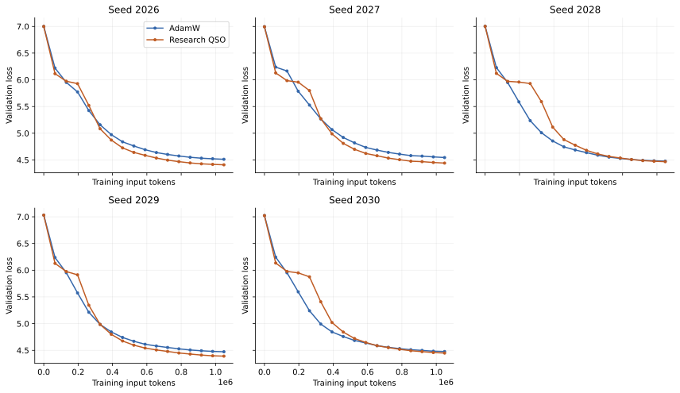
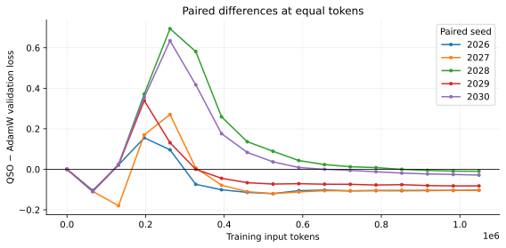
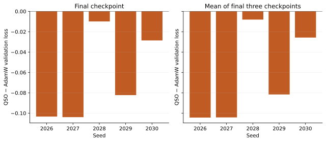
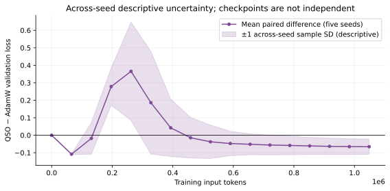

# Paired five-seed 512-step optimizer-quality study

Result: **A — MULTI-SEED QUALITY ADVANTAGE SUPPORTED**.

Research QSO completed **5/5** declared seed trajectories. The numerical logs contain **15,360** conservative primary-certified paired returns. Observed numerical failures: **0**; rank ambiguity: **0**; CPU reference calls: **0**.

The primary paired final-three validation difference (research QSO minus AdamW) was **-0.064776**, with a 95% paired Student-t interval **[-0.120781, -0.008771]**. The final-checkpoint paired mean was **-0.065574**. **5/5** seeds favored QSO on the primary metric.

This conclusion applies to the frozen research admission policy, this tiny model, local data prefix and 512-step horizon. Production-v0 was not changed. Primary certification does not establish minimum-Frobenius P-dagger selection on a nonunique face, and this study does not establish broad optimizer superiority.

The advantage is a **late-horizon** result. Mean post-initial validation difference was **+0.014090**, and mean normalized AUC difference was **+0.016139**. Both full-horizon means favor AdamW, with intervals spanning zero; research QSO does not dominate the entire learning curve. These secondary diagnostics are retained rather than suppressed or substituted for the predeclared final-three gate.

## 1. Frozen setup and pairing

| Setting | Value |
| --- | --- |
| Seeds | 2026, 2027, 2028, 2029, 2030; exactly the predeclared set |
| AdamW peak LR | 2e-4 |
| Research QSO paired peak LR | 0.0012247448713915891 |
| QSO unsupported-parameter AdamW LR | 3e-4 |
| Model | 11,457,408 parameters; 6 blocks, width 384, 6 heads, hidden 1024, vocabulary 1024 |
| Batch / context / accumulation | 16 / 128 / 1; 2048 input tokens per update |
| Length | 512 updates / 1,048,576 nonrepeated training input tokens per completed run |
| Schedule | 51 linear-warmup steps; unchanged cosine decay to 10% of peak |
| Validation | Four fixed batches at completed steps 0,32,...,512 |
| Betas / decay / clipping | Canonical EMA 0.95; AdamW (0.9,0.95); decay 0; no clipping |
| Precision | fp32 model storage and canonical EMA; bf16 forward/backward; fp64 smooth solve |
| Smooth / radial backend | Direct full fp64 thin SVD / gram_upper |
| Warm state | Previous original-coordinate lambda; no temporal prediction or factor recycling |
| Diagnostics | diagnostics=True; cast_diagnostics=False |
| Determinism | Existing deterministic contract, TF32 disabled, CUBLAS_WORKSPACE_CONFIG=:4096:8 |

The existing local FineWeb training and validation shards and tokenizer representation were reused: `/home/prignano/parameter-golf/data/datasets/fineweb10B_sp1024/fineweb_{train,val}_000000.bin` and `/home/prignano/parameter-golf/data/tokenizers/fineweb_1024_bpe.model`. The bounded training prefix has 1,048,577 tokens including lookahead. Each seed permutes all 8192 disjoint 128-token input blocks once. No wrapping, tokenization, download, network fallback, or environment installation occurred.

The experiment seed controls initialization and the single-pass training permutation. The existing `data.seed=2026` convention keeps validation batches fixed across all runs. Within each seed, initialization, all 512 expected minibatch hashes, validation-batch hashes, model, precision, schedule and token budget were asserted equal between methods. Hashes were recorded before training and checked against every completed minibatch online.

| Seed | Initial model SHA256 | Training permutation SHA256 |
| --- | --- | --- |
| 2026 | `0607adc4c9cffa7b902c0956fa7477ea274078fdc31406d84d527b79ca6a2401` | `b396bbb0fd4021e6c6427df4f396787a1d6ab916120696083c58108f6dccac97` |
| 2027 | `21d10ccbab2903d7d713970ec0fac70e0b7f1d18878dd5a4f7d37b746084ebeb` | `9917e66e8f3af199b336215e4343da40438b2435701ef5e2a3754a563f229eeb` |
| 2028 | `b85e72dab13ab052910acdd0080f577afd273610ecae024ac22d8871b742e43d` | `a5043b93a26018e32716ca1f1cd4e2129747ca0789dcef95d22a9b9348f9d630` |
| 2029 | `9e3887fe46044f4b56bcf948d6d3098faae0271cb9515a2600ad7e2051d35fcc` | `ef63ef75c52e57db2263eb1dc836b508b4c004f19c91f3817dcb7ee25a9b4fae` |
| 2030 | `e2fbbc8ad909a10b2fe992611f8162377a8bfb0ab3abbc8997c1210a347be804` | `e08bb2f8ace8b62011c3c6360d9443ce25118ff3b40b39ead8c3d58a661389b1` |

Training-prefix SHA256: `2db88d5f4b0da3484f766946b8090b0839e527a0088d55d156f851dcc5e63a59`. Validation-prefix SHA256: `09545e7dae1baab9e2c244bfc5d88103b759a56bc1d3a2aca83cb09b9a45db6a`. The manifest also records all four validation-batch digests and every expected training-batch digest.

Seed 2026 was reused after checking the original Stage-D immutable source/configuration hashes, the completed research source hashes, exact policy metadata, current prefix/permutation/batch hashes, initialization and initial validation, the complete 512-step logs, all 3072 returned research certificates, and its exact checkpoint-continuation record. The retained AdamW reference has the same model/data/schedule/precision/validation contract. Python executable, PyTorch, NumPy, CUDA and GPU model were checked against the new runs.

Historical AdamW did not retain explicit validation-batch digests. Its immutable validation code, data prefix and seed/configuration establish the same batches; the reconstructed digests are recorded in the new manifest. This is provenance compatibility, not a claim that unavailable historical validation tensors were compared directly.

## 2. Predeclared seed-level analysis

The statistical unit is the **seed**. Primary `Delta_last3` is QSO minus AdamW mean validation loss at steps 448,480,512. Secondary `Delta_final` is the corresponding step-512 difference. Negative favors QSO. All five seeds are included; checkpoints are not treated as independent samples. No LR, warmup, beta, decay, clipping, numerical tolerance, admission policy or seed set was adapted.

For each paired metric the interval is `mean ± t(0.975,4) * sample_sd/sqrt(5)`, with `t(0.975,4)=2.7764451051977987`. Classification A requires both means negative, at least four negative primary seed differences, a primary interval entirely below zero, and no QSO numerical-contract failure. A failed QSO seed triggers D and prevents complete-case inference; it is not discarded.

## 3. Complete paired quality results

| Seed | AdamW / QSO status | AdamW final | QSO final | Delta_final | AdamW last3 | QSO last3 | Delta_last3 |
| --- | --- | --- | --- | --- | --- | --- | --- |
| 2026 | passed / passed | 4.512301 | 4.408996 | -0.103305 | 4.522282 | 4.417955 | -0.104326 |
| 2027 | passed / passed | 4.545093 | 4.441223 | -0.103870 | 4.558160 | 4.454021 | -0.104139 |
| 2028 | passed / passed | 4.477531 | 4.467622 | -0.009909 | 4.485165 | 4.477104 | -0.008061 |
| 2029 | passed / passed | 4.473538 | 4.391285 | -0.082252 | 4.481640 | 4.400024 | -0.081615 |
| 2030 | passed / passed | 4.477320 | 4.448786 | -0.028535 | 4.486529 | 4.460790 | -0.025739 |

| Paired statistic | Mean | Median | Sample SD | SE | 95% paired mean CI | Seeds favoring QSO |
| --- | --- | --- | --- | --- | --- | --- |
| Primary last3 | -0.064776 | -0.081615 | 0.045105 | 0.020171 | [-0.120781, -0.008771] | 5 |
| Secondary final | -0.065574 | -0.082252 | 0.043700 | 0.019543 | [-0.119835, -0.011313] | 5 |
| Post-initial mean | 0.014090 | -0.026111 | 0.092788 | 0.041496 | [-0.101121, +0.129301] | 3 |
| Token-normalized trapezoidal AUC mean | 0.016139 | -0.023541 | 0.091423 | 0.040886 | [-0.097378, +0.129656] | 3 |

| Seed | Post-initial mean difference | AUC mean difference |
| --- | --- | --- |
| 2026 | -0.067516 | -0.064287 |
| 2027 | -0.062288 | -0.059042 |
| 2028 | 0.131764 | 0.132074 |
| 2029 | -0.026111 | -0.023541 |
| 2030 | 0.094599 | 0.095491 |

The AUC is the normalized trapezoidal area over common equal-token checkpoints, including step 0. The post-initial mean equally weights steps 32 through 512. The full precision values are in the structured summary; displayed tables are rounded.

Actual validation points are plotted without smoothing. The mean-curve band is ±1 sample standard deviation across five seed differences, **descriptive**, not checkpoint-level significance or a simultaneous confidence band.

## 4. Research contract and numerical robustness

Normal returned pairs use `primary_epsilon_lmo_full_rank`, `selection_certified=False`. Under the inherited conditional normal-finite fp64 gamma model, the certificate bounds primary support regret for an exactly feasible mathematical proxy. Every normal return requires positive alpha lower bounds on both sides, positive dual lower bound, conservative `G_upper/dual_lower <= 3e-5`, signed raw normalized gap `>= -1e-10`, normalized horizontality `<= 1e-10`, spectral excess `<= 1e-12`, and finite state. No fitted direction-distance threshold is used. Exact intrinsic zero retains exact-zero selection.

The isolated scope forbids CPU reference calls and restores the production solve boundary on exit. A failed pair cannot commit any paired proposal; the unchanged optimizer's atomic pair validation is covered by tests. Invalid intermediate decompositions also stop the trajectory. The old rcond threshold remains a diagnostic and is not replaced by a lower constant.

| Seed | Returned pairs | Below old guard | Min rcond | Min alpha_lower | Min sigma_min/eta | Max conservative gap | Rank / numerical failures |
| --- | --- | --- | --- | --- | --- | --- | --- |
| 2026 | 3072 | 8 (0.2604%) | 8.678984e-05 | 2.707977e-06 | 2.640486e+06 | 2.979772e-05 | 0 / 0 |
| 2027 | 3072 | 102 (3.3203%) | 3.921011e-05 | 2.390971e-06 | 1.184320e+06 | 2.998690e-05 | 0 / 0 |
| 2028 | 3072 | 96 (3.1250%) | 3.926548e-05 | 2.103875e-06 | 1.185464e+06 | 2.993740e-05 | 0 / 0 |
| 2029 | 3072 | 0 (0.0000%) | 4.619181e-04 | 2.391183e-06 | 1.161661e+07 | 2.947107e-05 | 0 / 0 |
| 2030 | 3072 | 0 (0.0000%) | 1.437667e-04 | 1.209117e-06 | 4.325131e+06 | 2.989199e-05 | 0 / 0 |
| Pooled | 15360 | 206 (1.3411%) | 3.921011e-05 | 1.209117e-06 | 1.184320e+06 | 2.998690e-05 | 0 / 0 |

| Seed | Newton bins 0 / 1 / 2 / 3+ | CG median / p95 / max | Line trials median / p95 / max |
| --- | --- | --- | --- |
| 2026 | 0 / 0 / 355 / 2717 | 9.000/13.000/17.000 | 3.000/3.000/3.000 |
| 2027 | 0 / 0 / 396 / 2676 | 9.000/14.000/26.000 | 3.000/3.000/4.000 |
| 2028 | 0 / 0 / 360 / 2712 | 9.000/16.000/48.000 | 3.000/3.000/4.000 |
| 2029 | 0 / 0 / 366 / 2706 | 9.000/11.000/21.000 | 3.000/3.000/4.000 |
| 2030 | 0 / 0 / 419 / 2653 | 9.000/14.000/21.000 | 3.000/3.000/4.000 |
| Pooled | 0 / 0 / 1896 / 13464 | 9.000/14.000/48.000 | 3.000/3.000/4.000 |

| Seed | Below-guard block and zero-based steps | U / D / both counts | Solves with any below-guard evaluation |
| --- | --- | --- | --- |
| 2026 | blocks.1.mlp: 8 at 87–94 | 0 / 8 / 0 | 8 |
| 2027 | blocks.0.mlp: 20 at 90–109; blocks.1.mlp: 33 at 90–122; blocks.2.mlp: 30 at 90–119; blocks.3.mlp: 19 at 90–108 | 82 / 100 / 80 | 102 |
| 2028 | blocks.0.mlp: 3 at 86–88; blocks.1.mlp: 42 at 86–127; blocks.2.mlp: 38 at 86–123; blocks.3.mlp: 13 at 86–98 | 72 / 96 / 72 | 96 |
| 2029 | None | 0 / 0 / 0 | 0 |
| 2030 | None | 0 / 0 / 0 | 0 |

Final below-old-guard events occurred in **3/5** seeds. The table shows whether they recur in the early block/step region rather than assuming seed-2026's eight block-1 down-side events are universal. U and D counts each include both-side events; the both column is their intersection.

Pooled counts by block: blocks.0.mlp: 23; blocks.1.mlp: 83; blocks.2.mlp: 68; blocks.3.mlp: 32. Blocks 4 and 5 had no final below-old-guard event.

| Seed | CG median steps 0–63 | 64–127 | 128–255 | 256–511 | Maximum Newton count |
| --- | --- | --- | --- | --- | --- |
| 2026 | 5.0 | 9.0 | 9.0 | 9.0 | 3 |
| 2027 | 5.0 | 10.0 | 10.0 | 9.0 | 4 |
| 2028 | 5.0 | 10.0 | 13.0 | 9.0 | 4 |
| 2029 | 5.0 | 10.0 | 9.0 | 9.0 | 4 |
| 2030 | 5.0 | 9.0 | 13.0 | 9.0 | 4 |

Pooled maximum normalized horizontality: `1.668731e-16`; maximum spectral excess: `0.000000e+00`; maximum feasible-proxy distance bound: `4.503966e-11`. Minimum evaluated rcond: `3.912576e-05`. Total smooth evaluations: 59,560; residual matrices decomposed: 119,120. CG termination counts: `{'residual_target': 44200}`. Largest CG action: 19 queries.

These minima refer to the logged final pair quantities unless explicitly labeled evaluated. Every intermediate evaluation passed the research rank posterior; final sigma_min/eta and alpha are not reinterpreted as universal condition-number thresholds. The structured summary retains exact Newton histograms and per-seed work/failure data.

There was no pathological late solver-work growth: the largest Newton count was 4; all 44,200 CG actions reached the existing residual target. Total line trials equaled total Newton actions, so no line-search backtracking occurred. The largest per-pair CG count includes multiple Newton actions; the largest individual action used 19 queries, below the unchanged 30-query budget. CG work rose in the middle region and settled in the latter half, as the region table shows.

## 5. Checkpoint continuation

| Seed | Checkpoint / replay | Exact continuation | Checkpoint bytes |
| --- | --- | --- | --- |
| 2026 | 256 / 257,258,259 | True | 118735811 |
| 2027 | 256 / 257,258,259 | True | 118737155 |
| 2028 | 256 / 257,258,259 | True | 118737155 |
| 2029 | 256 / 257,258,259 | True | 118737091 |
| 2030 | 256 / 257,258,259 | True | 118737091 |

Each new QSO seed saves one checkpoint at step 256. An independently loaded model/optimizer replays three steps and compares batch hashes, losses, complete model/optimizer state trees, and pair admission/rank/value decisions exactly. Canonical EMA, original lambda, pair counters, unsupported AdamW state, schedule, data position and policy metadata are covered. Replay steps are diagnostics, excluded from quality token counts and solver/step aggregates. Their work is included in training wall time. No checkpoint is stored for every training step.

The four new continuation checks execute 72 additional diagnostic pair solves (18 per seed), all through the same certificate-enforcing adapter. The reused seed-2026 check adds 18 historical diagnostic solves. These are separate from the planned 15,360 training-pair aggregate.

## 6. Implementation cost, separate from equal-token quality

| Seed | Method | Wall s | Step sum s | Warm step median / p95 s | Tokens/s | Optimizer fraction | Peak MiB |
| --- | --- | --- | --- | --- | --- | --- | --- |
| 2026 | adamw | 15.173 | 13.731 | 0.026785 / 0.026978 | 76368.2 | 0.0749 | 542.67 |
| 2026 | qso | 766.229 | 736.670 | 1.476642 / 1.514489 | 1423.4 | 0.9816 | 528.53 |
| 2027 | adamw | 42.943 | 14.690 | 0.028097 / 0.028374 | 71379.9 | 0.0747 | 539.80 |
| 2027 | qso | 765.344 | 736.022 | 1.478663 / 1.526443 | 1424.7 | 0.9818 | 528.16 |
| 2028 | adamw | 53.485 | 14.848 | 0.027973 / 0.032739 | 70619.4 | 0.0737 | 539.80 |
| 2028 | qso | 776.827 | 741.074 | 1.478950 / 1.545635 | 1414.9 | 0.9818 | 529.47 |
| 2029 | adamw | 43.433 | 14.702 | 0.028100 / 0.028427 | 71322.3 | 0.0745 | 539.80 |
| 2029 | qso | 762.501 | 733.279 | 1.472904 / 1.497821 | 1430.0 | 0.9817 | 527.28 |
| 2030 | adamw | 39.612 | 14.536 | 0.027877 / 0.028042 | 72137.8 | 0.0755 | 539.80 |
| 2030 | qso | 762.971 | 733.745 | 1.476227 / 1.522521 | 1429.1 | 0.9819 | 528.78 |

| Seed | Warm QSO six-pair median / p95 s | Warm AdamW F/B median / p95 s | Warm QSO F/B median / p95 s | QSO/Adam wall / step sum / warm median |
| --- | --- | --- | --- | --- |
| 2026 | 1.435372 / 1.473251 | 0.011220 / 0.011377 | 0.012223 / 0.012450 | 50.50x / 53.65x / 55.13x |
| 2027 | 1.437239 / 1.484909 | 0.012112 / 0.012269 | 0.012217 / 0.012469 | 17.82x / 50.10x / 52.63x |
| 2028 | 1.437837 / 1.503769 | 0.012176 / 0.016328 | 0.012217 / 0.013937 | 14.52x / 49.91x / 52.87x |
| 2029 | 1.431686 / 1.456656 | 0.012136 / 0.012336 | 0.012187 / 0.012356 | 17.56x / 49.88x / 52.42x |
| 2030 | 1.435342 / 1.481237 | 0.012066 / 0.012180 | 0.012146 / 0.012386 | 19.26x / 50.48x / 52.95x |

| Cost ratio | Mean | Median | p95 | Range |
| --- | --- | --- | --- | --- |
| wall | 23.93x | 17.82x | 44.25x | 14.52x–50.50x |
| measured_step | 50.80x | 50.10x | 53.02x | 49.88x–53.65x |
| warm_median | 53.20x | 52.87x | 54.70x | 52.42x–55.13x |

Warm summaries exclude zero-based steps 0–4, not unfavorable later intervals. Cold first-step costs are retained in the structured summary. Synchronization-aware timers come from the existing harness. Tokens/sec uses completed training tokens divided by measured step-time sum. Wall time includes validation, between-step state checks and, for QSO, checkpoint writing/replay; initial model/data setup precedes the timer. Peak PyTorch allocation excludes the extra replay model and non-PyTorch CUDA allocations.

The four new paired comparisons run sequentially, one H100 per SLURM job, under the account's one-GPU quota. AdamW and QSO for each new seed share an allocation; different seeds and the reused seed-2026 methods came from different allocations. Cost ratios describe observed implementation cost, not a universal hardware-independent optimizer cost or a criterion for choosing hyperparameters.

Wall-time ratios also reflect observational harness differences: the new runner fingerprints the model between every step for both methods; the historical Stage-D AdamW runner did not perform that check. The previous research QSO runner already did. Thus seed-2026 versus new-seed wall ratios are not instrumentation-identical. Measured-step and warm-step ratios exclude these between-step digests and are the more comparable implementation-cost measures. No run was repeated or changed in response to its measured cost.

Pooled instrumented rank posterior: 107.553 s; value posterior: 129.782 s. These reuse matching smooth factors and add no tall SVD solely for logging.

## 7. Update-scale diagnostics

| Seed | Method | Maximum update / parameter RMS | Final gradient RMS | Final update RMS | Final parameter RMS | Final update / parameter RMS |
| --- | --- | --- | --- | --- | --- | --- |
| 2026 | adamw | 2.911720e-03 | 4.310216e-04 | 4.695966e-06 | 2.752715e-02 | 1.705940e-04 |
| 2026 | qso | 3.387023e-03 | 5.096780e-04 | 6.403351e-06 | 2.790296e-02 | 2.294864e-04 |
| 2027 | adamw | 2.775153e-03 | 4.599768e-04 | 4.802655e-06 | 2.752919e-02 | 1.744568e-04 |
| 2027 | qso | 3.469590e-03 | 5.507870e-04 | 6.562405e-06 | 2.790044e-02 | 2.352080e-04 |
| 2028 | adamw | 2.163341e-03 | 3.963069e-04 | 4.791080e-06 | 2.757093e-02 | 1.737729e-04 |
| 2028 | qso | 3.411296e-03 | 5.135412e-04 | 6.620499e-06 | 2.790395e-02 | 2.372603e-04 |
| 2029 | adamw | 2.168254e-03 | 4.037473e-04 | 4.764037e-06 | 2.756235e-02 | 1.728458e-04 |
| 2029 | qso | 3.083209e-03 | 5.098787e-04 | 6.441279e-06 | 2.790749e-02 | 2.308082e-04 |
| 2030 | adamw | 2.157098e-03 | 4.004988e-04 | 4.729023e-06 | 2.756707e-02 | 1.715461e-04 |
| 2030 | qso | 3.353387e-03 | 5.154077e-04 | 6.498690e-06 | 2.793978e-02 | 2.325963e-04 |

These Euclidean diagnostics are not gauge-invariant admission certificates. The complete logs retain training loss, gradient/update/parameter RMS, and update ratios throughout each trajectory. No exploratory extra training run was launched.

## 8. Provenance, validation and artifacts

The complete suite passed on H100 before training: **462 passed, 0 failed, 0 skipped**. Focused new tests cover frozen pairing, complete-five-seed inference, common checkpoint metrics, confidence intervals, failure retention, and the predeclared gate. The SLURM array initially rejected seed-number task indices; replacing them with indices 0–3 mapped to 2027–2030 was checked by a second preflight before any training. This was infrastructure correction, not hyperparameter adaptation.

| Seed | AdamW SLURM job | Research QSO SLURM job |
| --- | --- | --- |
| 2026 | 29024 | 29082 |
| 2027 | 29095 | 29095 |
| 2028 | 29097 | 29097 |
| 2029 | 29098 | 29098 |
| 2030 | 29094 | 29094 |

Frozen study manifest: `/home/prignano/qnormuon-runs/paired-multiseed/study-29093/manifest.json` (preflight job 29093). It records all source hashes, seed data/initialization contracts and predeclared analysis. Production and admission sources were verified unchanged before/after each job and again during analysis. The validated environment remained Python 3.10.20, PyTorch 2.10.0+cu128, CUDA 12.8, NumPy 2.2.6, NVIDIA H100 NVL. Jobs requested four CPUs and 16 GiB host memory. Offline guards recorded no attempted network access.

Reusable files: [frozen analysis rules](../benchmarks/multiseed.py), [runner](../cluster/run_qso_multiseed.py), [preflight](../cluster/preflight_qso_multiseed.sbatch), [training SLURM script](../cluster/run_qso_multiseed.sbatch), [aggregation/figures](../cluster/analyse_qso_multiseed.py), [analysis SLURM script](../cluster/analyse_qso_multiseed.sbatch), [report renderer](../cluster/report_qso_multiseed.py), and [regressions](../tests/test_multiseed.py). The numerical solver/adapter were reused without edits.

Large artifacts remain outside the source tree at `/home/prignano/qnormuon-runs/paired-multiseed/study-29093`: per-seed/per-method provenance, metric logs, validation logs, QSO solve logs, summaries, one QSO checkpoint per new completed seed, and exact continuation records. `analysis.json` holds full-precision tables and pooled metrics; [project summary](../cluster/qso_multiseed_summary.json) is a compact copy. Figures have standalone SVG and PDF versions.

## 9. Limitations and predeclared decision

Five seeds are a small sample. Student-t coverage uses the conventional approximately normal independent paired-seed model; the interval is not a guarantee about other architectures, datasets, validation samples, horizons or hyperparameter choices. Seed 2026 participated in LR tuning and is included as explicitly predeclared; these five outcomes are not all held-out tuning seeds. Validation uses the same small fixed four-batch sample. This compares the two tuned configurations, including different AdamW rates for unsupported parameters; it does not isolate the paired update's causal contribution. The numerical certificate is conditional fp64 error analysis, not directed interval arithmetic or a full CUDA implementation proof. It applies before model-dtype casting and parameter addition, and does not certify secondary P-dagger selection.

The predeclared multi-seed gate is met. The seed-2026 late quality advantage replicates under the declared fixed-hyperparameter comparison. A **separate** production-v1 engineering task and separate performance plan are scientifically justified, with the primary-only scope and very high implementation cost explicit. Neither integration nor more training is performed here.

Production-v0 remains full fp64 thin SVD with `rcond_guard=1e-4`, previous original lambda, `gram_upper`, existing certificates and explicit CPU reference fallback. No extra seed, retuning, backend change, production integration or broad superiority claim is authorized by completion of this report.

## 10. Explicit answers

1. **All QSO seeds complete?** 5/5; per-seed status is in section 3.
2. **All returned pairs satisfy the primary contract?** 15,360 logged returns were audited against unchanged conservative value/rank/feasibility checks; selection scope remains separate.
3. **Five Delta_final values?** Section 3 lists each seed without omission.
4. **Five Delta_last3 values?** Section 3 lists the predeclared primary differences.
5. **Paired means and 95% intervals?** Section 3 reports sample SD, SE and df=4 intervals; no checkpoint pseudo-replication.
6. **How many favor QSO?** The primary and secondary counts are in the paired-statistic table.
7. **Seed-2026 advantage replicated?** The predeclared result is A; section 9 states its permitted interpretation.
8. **Below-old-guard events common?** Section 4 localizes every final event by seed, block and step.
9. **Numerical work stable?** Section 4 reports exact Newton bins, CG/line tails and explicit failures.
10. **Implementation-cost distribution?** Section 6 separates wall, measured-step and warm-median ratios.
11. **Multi-seed gate met?** Yes, classification A.
12. **Production-v1 engineering justified?** A separate engineering task and performance plan are justified; no integration occurs here.
